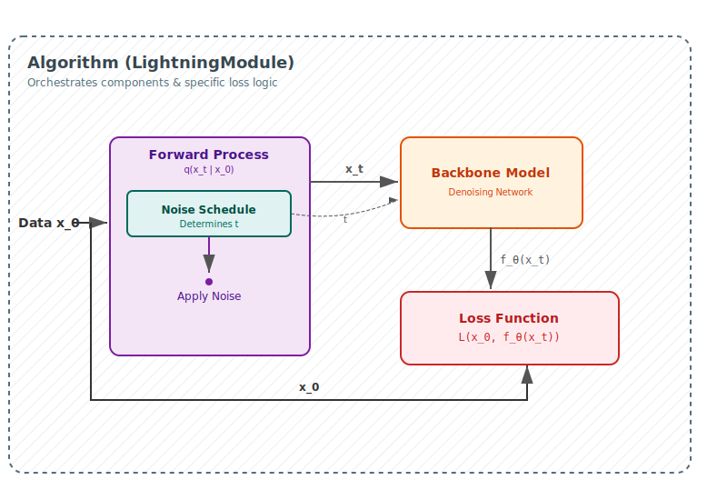

# Architecture Guide

This guide explains the core components of the UNI-D² library.

## Overview

The library follows a modular design where Algorithms coordinate training and inference by combining interchangeable components. A LightningModule (Algorithm) orchestrates the interaction between components and defines the specific loss computation logic, connecting the Forward Process (noise), Noise Schedule (timing), Backbone Model (denoising), and Sampler (generation).

## Key Abstractions

### Algorithms
Algorithms (e.g., `AbsorbingState`, `Uniform`) are LightningModules that manage the training loop, optimization, and metric logging. They bind the forward process, noise schedule, and backbone model together to define the specific diffusion logic and loss computation.

### Forward Processes
The `ForwardProcess` abstraction applies noise to data to produce latent states $x_t$ given $x_0$. It defines the transition distribution $q(x_t|x_0)$, handling masking or corruption strategies independent of the training loop.

### Noise Schedules
`NoiseSchedule` defines the continuous-time dynamics of the diffusion process, providing attenuation factors $\alpha(t)$ and derivatives $\alpha'(t)$. It controls the rate of information destruction, supporting various schedules like cosine, linear, or geometric.

### Models
Models (e.g., `DIT`) are the neural network backbones responsible for predicting $x_0$ or scores from noisy inputs $x_t$ and time embeddings. They are agnostic to the specific diffusion algorithm and simply map noisy states and noise levels to denoised predictions.

### Samplers
Samplers define the reverse diffusion process, converting the model's predictions into a sequence of generated tokens. They implement strategies like posterior computation to iteratively refine random noise back into coherent data.
